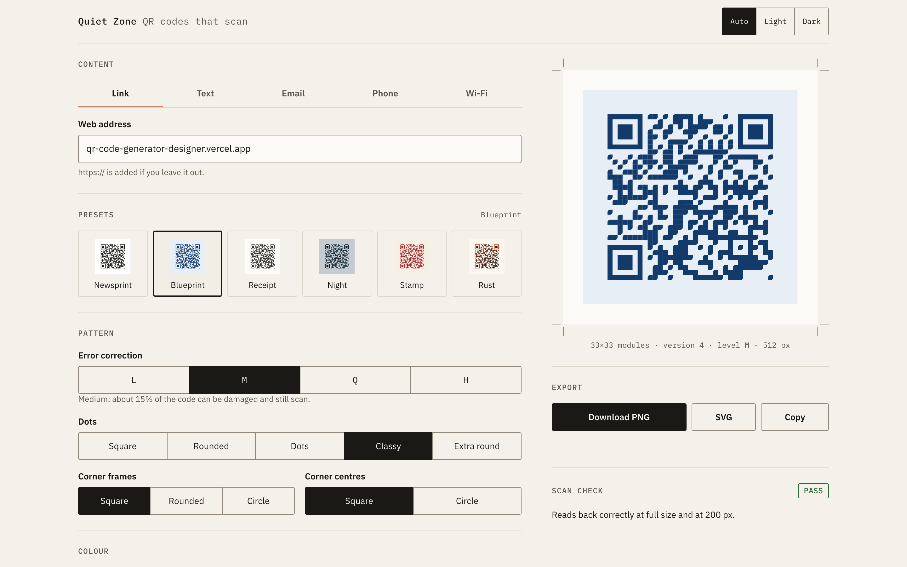
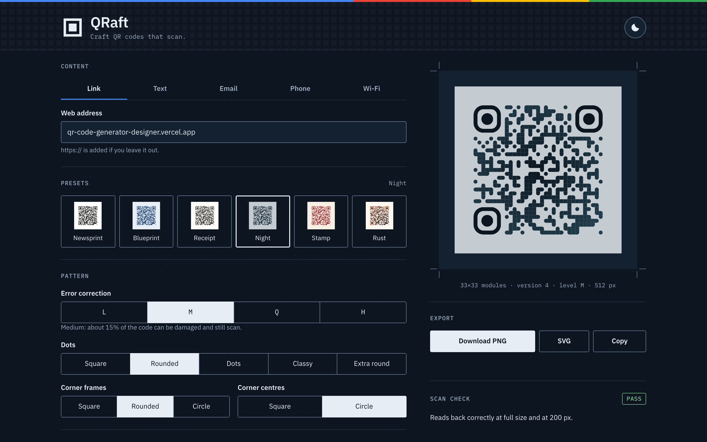
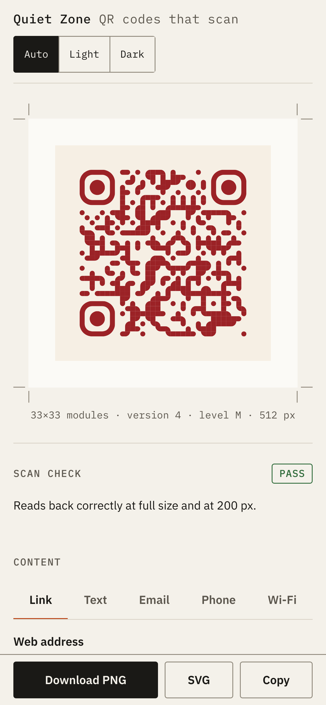
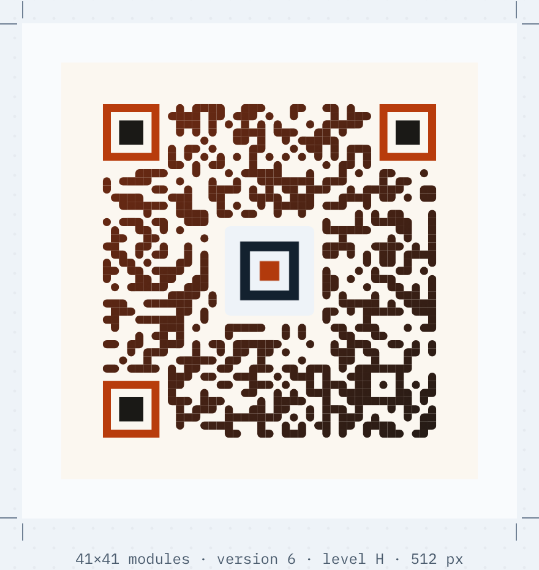
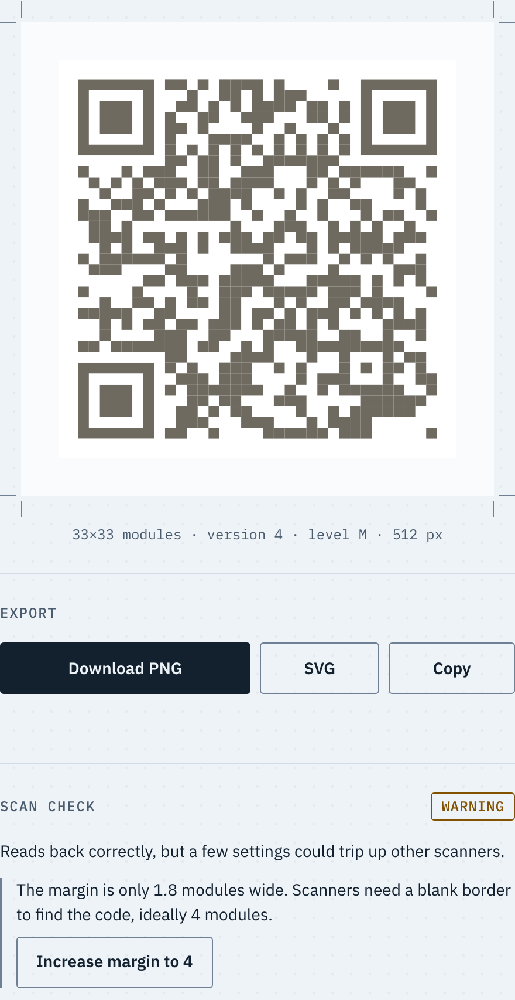
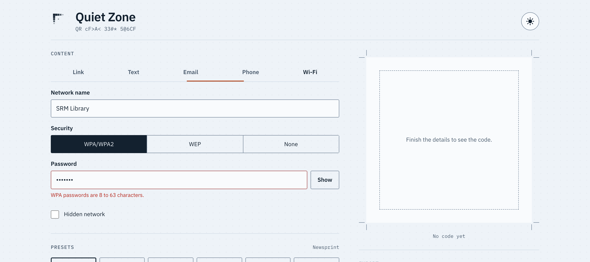
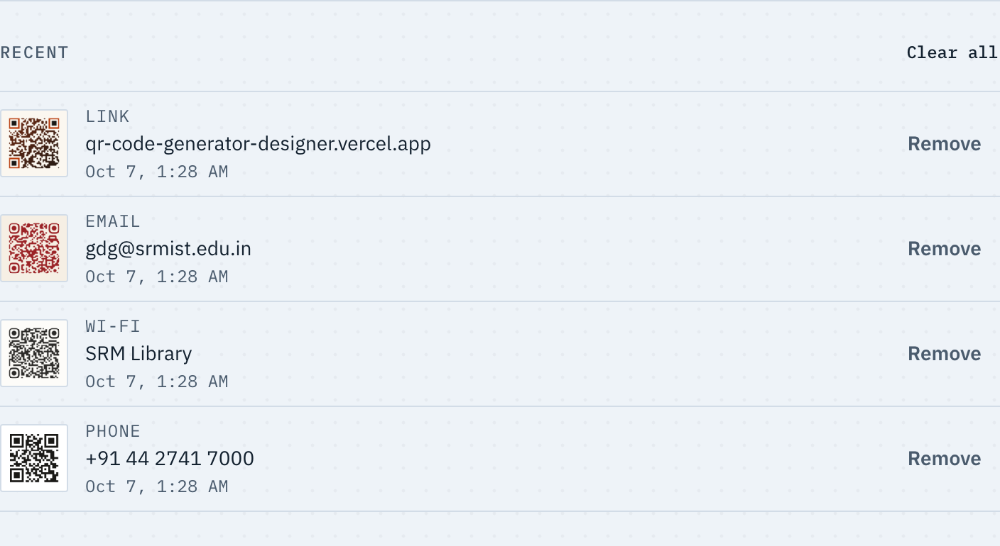

# QRaft

[](https://github.com/akshat18-gg/QR-Code-Generator-Designer/actions/workflows/ci.yml)

QRaft is a QR code generator and designer that runs entirely in the browser. You pick what the code should hold (a link, text, an email, a phone number or Wi-Fi details), style it, and download it as PNG or SVG. Before you print it, a scan check reads the code back and tells you if anything you changed made it harder to scan.

QRaft = QR + craft: you craft a QR code, then check that it scans.

**Live:** https://qr-code-generator-designer.vercel.app/

I built this for the GDG on Campus SRM recruitment task (Frontend, Task 1: QR Code Generator & Designer).

## Screenshots

| Desktop, light                                   | Desktop, dark                                  |
| ------------------------------------------------ | ---------------------------------------------- |
|  |  |

| Phone                            | Gradient and logo                      | Scan check with a fix                               |
| -------------------------------- | -------------------------------------- | --------------------------------------------------- |
|  |  |  |

| Wi-Fi form with a validation error         | Recent codes                            |
| ------------------------------------------ | --------------------------------------- |
|  |  |

## Features

- Five QR types: link, plain text, email, phone and Wi-Fi. Each type keeps what you typed when you switch tabs.
- Live preview that updates as you type, with a clean placeholder when the input is empty or invalid.
- Tamil, Hindi, emoji and any other text are encoded as UTF-8 and scan back exactly.
- A clear message when the content is too long for one QR code, instead of a crash.
- Size (128 to 1024 px), dot and background colours, error correction (L/M/Q/H), margin.
- Dot styles (square, rounded, dots, classy, extra round), corner frame and centre styles, each corner part with its own colour.
- Linear or radial gradients on the dots.
- Logo upload (PNG, JPG or SVG up to 2 MB) with size, padding and "clear the dots behind it".
- Six presets with live thumbnails: Newsprint, Blueprint, Receipt, Night, Stamp and Rust.
- Download as PNG at the chosen size, as a standalone SVG, or copy the PNG to the clipboard.
- Scan check: rule-based hints plus a real decode test, with one-click fixes.
- The last 12 codes you downloaded or copied, saved in the browser and restored with one click.
- A "drafting table" look: pale blue-white paper with a faint dot grid, or deep navy in dark mode.
- A header with a finder-pattern logo that assembles itself and gets a scan-line sweep, and a tagline that decodes in. It plays once (hovering the logo replays the sweep), and not at all with reduced motion.
- Small touches, all 200 ms or less: the tab underline slides to the selected tab, preset cards lift their thumbnail on hover, and the preview cross-fades when the code changes.
- Light and dark theme, works on phones down to 360 px, keyboard and screen reader friendly.
- Works offline after the first visit and can be installed as an app.

## Requirements checklist

Every item from the task brief, and where it's done.

| Task                         | How I did it                                                                                                                                                                                                                                           | Where                                                                                                 |
| ---------------------------- | ------------------------------------------------------------------------------------------------------------------------------------------------------------------------------------------------------------------------------------------------------ | ----------------------------------------------------------------------------------------------------- |
| 1. QR code generation        | The code redraws on every keystroke. Style changes are debounced by 80 ms so dragging a slider doesn't stutter. Empty or invalid input shows a placeholder of the same size, so nothing jumps.                                                         | `src/App.tsx`, `src/components/Preview.tsx`, `src/lib/status.ts`                                      |
| 2. Different QR types        | Tabs for link, text, email, phone and Wi-Fi. Each tab shows only its own fields and keeps its values when you switch away.                                                                                                                             | `src/components/TypeTabs.tsx`, `src/components/ContentForm.tsx`, `src/lib/payload.ts`                 |
| 3. QR customisation          | Size, colours (picker and hex box kept in sync, plus a swap button), error correction with a one-line hint per level, and margin in modules. Every change shows in the preview straight away.                                                          | `src/components/SizePanel.tsx`, `ColourPanel.tsx`, `PatternPanel.tsx`                                 |
| 4. Presets                   | Six presets, each with a live thumbnail of your own content. A preset only sets the look, so size, margin, error correction and logo stay as you left them. Change a colour or pattern afterwards and the label switches to "Custom".                  | `src/state/presets.ts`, `src/components/PresetList.tsx`                                               |
| 5. Download                  | PNG at the chosen pixel size, named like `qr-wifi-2026-10-04.png`. The preview and every export are built from the same options object, so they always match.                                                                                          | `src/lib/qrConfig.ts`, `src/lib/exportQr.ts`, `src/components/ExportBar.tsx`                          |
| 6. Validation                | Per-field checks with short, specific messages, shown under the field once you've left it. Fields get `aria-invalid` and `aria-describedby`. Export stays disabled, with the reason shown, until the input is valid.                                   | `src/lib/validate.ts`, `src/components/TextField.tsx`                                                 |
| 7. Scan reliability          | Rule-based hints (contrast, inverted colours, quiet zone, module size, logo, density) and a real decode test with jsQR at full size and at 200 px. Fixes are one click.                                                                                | `src/lib/contrast.ts`, `src/lib/scanRules.ts`, `src/lib/scanCheck.ts`, `src/components/ScanCheck.tsx` |
| 8. Recent QR codes           | Saved to localStorage on download or copy. Keeps the latest 12 with no duplicates, survives a refresh, and restores everything with one click. Each item can be removed, and "Clear all" asks first. Corrupt data or a full quota never crash the app. | `src/state/recent.ts`, `src/hooks/useRecent.ts`, `src/components/RecentList.tsx`                      |
| 9. Responsive design         | Two columns on desktop with the preview sticky; on phones the preview comes first and the export buttons are pinned to the bottom. No horizontal scroll from 360 px up, and touch targets are at least 44 px.                                          | `src/styles/layout.css`, `e2e/responsive.spec.ts`                                                     |
| 10. Testing                  | 183 unit tests (Vitest) and 104 end-to-end tests (Playwright). Every QR type, option and preset is downloaded and decoded, plus invalid input, persistence, layout at 4 widths and axe in both themes. CI runs it all on every push.                   | `src/**/*.test.ts`, `e2e/`, `.github/workflows/ci.yml`, [TESTING.md](TESTING.md)                      |
| Optional: SVG download       | SVG export with the logo embedded as a data URL, so the file works on its own.                                                                                                                                                                         | `src/lib/exportQr.ts`                                                                                 |
| Optional: logo               | PNG, JPG or SVG up to 2 MB (anything else gets a clear message), with size, padding, "clear the dots behind it" and remove.                                                                                                                            | `src/components/LogoPanel.tsx`, `src/lib/image.ts`                                                    |
| Optional: gradient QR codes  | Off, linear (with an angle) or radial, on the dots. Corners keep solid colours that follow the dot colour until you pick your own.                                                                                                                     | `src/components/ColourPanel.tsx`, `src/lib/qrConfig.ts`                                               |
| Optional: copy to clipboard  | `navigator.clipboard.write` with a `ClipboardItem`, a "Copied" confirmation, and a fallback message if the browser can't copy images.                                                                                                                  | `src/lib/exportQr.ts`                                                                                 |
| Optional: custom QR patterns | Five dot styles, three corner frame styles and two corner centre styles.                                                                                                                                                                               | `src/components/PatternPanel.tsx`                                                                     |
| Optional: dark/light theme   | One round sun/moon button that morphs between the two. The first visit follows the system setting; after a click the choice is remembered. Colours fade over 200 ms, and an inline script sets the theme before the first paint so there's no flash.   | `src/hooks/useTheme.ts`, `index.html`                                                                 |
| Deploy                       | Vercel, deploying every push to `main`.                                                                                                                                                                                                                | https://qr-code-generator-designer.vercel.app/                                                        |

## How each QR type is encoded

All of this is in `src/lib/payload.ts` as pure functions, with validation in `src/lib/validate.ts`.

- **Link:** if there's no scheme, I add `https://`, so `example.com` becomes `https://example.com`. It has to parse with the `URL` constructor, use http or https, and have a real host name. `javascript:` links are rejected.
- **Text:** encoded as typed. A character counter sits under the box, and a warning appears once the code goes past version 10 (57×57 modules).
- **Email:** `mailto:to?subject=…&body=…`. Subject and body go through `encodeURIComponent`, and line breaks in the body become CRLF, as RFC 6068 asks.
- **Phone:** spaces and dashes are stripped, giving `tel:+919876543210`. Only digits, spaces, dashes and a leading `+` are allowed, and the number must have 7 to 15 digits.
- **Wi-Fi:** `WIFI:T:WPA;S:<ssid>;P:<password>;H:<true|false>;;`.
  - `\ ; , : "` are escaped with a backslash in the network name and password, because the format uses them as separators.
  - Open networks use `T:nopass` and leave the password out.
  - WPA passwords must be 8 to 63 characters. WEP keys must be 5 or 13 characters, or 10 or 26 hex digits.
  - The network name is limited to 32 bytes of UTF-8, not 32 characters, because that's what routers count.

**UTF-8.** qr-code-styling bundles its own copy of `qrcode-generator`. That copy turns text into bytes with `charCode & 0xff`, which breaks anything outside Latin-1, and since it's bundled I can't swap the function from outside. So `toQrData` in `src/lib/qrData.ts` encodes the text with `TextEncoder` first and passes a string with one character per UTF-8 byte. The `& 0xff` step then writes exactly those bytes, and scanners read them back as UTF-8. Tests round-trip Tamil, Hindi and emoji through jsQR.

**Overflow.** Before drawing anything, `analyse()` runs `qrcode-generator` itself on the same data at the chosen level. If it throws "code length overflow", the preview shows "Too much text for one QR code at level H. Shorten it or lower the error correction." instead of a broken code. The same step reports the version and module count that the scan rules use.

## How the scan check works

The rules explain why a code might fail; the decode test proves whether it actually works.

**Rules** (`src/lib/scanRules.ts`, using `src/lib/contrast.ts`):

- **Contrast:** the WCAG contrast ratio between the background and every colour that draws the code: the dots, the gradient's end colour and both corner colours. The weakest one counts. Below 4:1 is "low", below 2.5:1 is "very low".
- **Inverted colours:** any part of the code lighter than the background. Many scanner apps only look for dark codes on light paper.
- **Quiet zone:** the margin that's actually drawn, in modules, including the spare pixels qr-code-styling adds when it rounds module sizes down. Under 2 modules is flagged.
- **Module size:** each square under 3 px means the image is too small for this much data. The fix suggests an exact size.
- **Logo:** a logo at level L or M, or a logo that uses more than half of what error correction can repair.
- **Density:** above version 10, it suggests a minimum print width.

**Decode test** (`src/lib/scanCheck.ts`). 300 ms after you stop changing things, it renders the exact PNG the Download button would make. It decodes that with jsQR at full size, then again shrunk to 200 px, roughly a small print. The decoded text must match the payload exactly. I use `inversionAttempts: 'dontInvert'` on purpose, because many phone scanners don't try the inverted image either.

**Status.** The decode test has the final say:

- **Fail:** the full-size image can't be read.
- **Warning:** only the 200 px copy fails, or a rule found something.
- **Pass:** neither.

A rule can never fail a code that actually scans.

**One-click fixes.** Each fix is a small change to the style, such as `{ margin: 4 }` or `{ ecLevel: 'H' }`. Before showing a fix, I apply it to a copy of the current style and only offer it if that actually clears the problem. For example, "Swap colours" doesn't appear when a gradient would leave the code inverted; "Use dark on white" appears instead.

Two things I learned while testing this:

- jsQR has trouble with round centres inside square corner frames, and with the separate round "dots" style, but only for some payloads. Neither is a bug in the code, so instead of banning those styles, the scan check names them as the likely cause when a decode fails, with a fix like "Use square corner centres". I also changed the Receipt preset after it failed on one test payload.
- jsQR happily reads a pixel-perfect code with no margin at all, but many phone cameras won't. That's why the margin rule exists alongside the decode test, and there's a unit test that documents it.

## Architecture

```
src/
  lib/          pure logic, no React: payloads, validation, UTF-8 and overflow, style model,
                qr-code-styling options, contrast, scan rules, decode test, export, images
  state/        the editor reducer, presets, recent-codes storage, useEditor hook
  hooks/        debouncing, drawing a code into a div, scan check, recents, theme
  components/   one small component per panel (TypeTabs, ContentForm, PatternPanel, ColourPanel,
                LogoPanel, SizePanel, PresetList, Preview, ScanCheck, ExportBar, RecentList, ...)
  styles/       tokens, base, layout, controls, components (plain CSS with custom properties)
e2e/            Playwright specs and helpers
```

**State.** One `useReducer` holds:

- the selected type
- the inputs for all five types, so switching tabs keeps them
- which fields have been touched
- the style

Everything else is derived with `useMemo`: the payload, the field errors, the preview status (empty, invalid, overflow, too small or ready) and the qr-code-styling options.

**Data flow.**

1. State goes through `buildPayload` and `validate`, then `analyse` (UTF-8 encoding, overflow and version).
2. `toQrOptions` turns the result into qr-code-styling options.
3. Those same options feed the preview, the PNG and SVG downloads, the clipboard copy and the scan check, which is why they can't drift apart.

The preview builds a fresh qr-code-styling instance each time instead of calling `update()`, because `update()` deep-merges options and can't turn a gradient or logo back off.

## Decisions and why

- **qr-code-styling for drawing.** It's the only library I found that does dot styles, corner styles, gradients, logos, and both canvas and SVG output in one place. Writing that myself would have taken the time I wanted for the scan check. Its downsides are the UTF-8 bug and `update()` merging options; I worked around both, as described above.
- **jsQR for the scan check.** It's pure JavaScript, works on a canvas's pixel data and has no dependencies. It's 48 KB gzipped, so it loads in a separate chunk the first time there's a code to check, and doesn't slow down the first paint.
- **Recent codes are saved on download or copy, not while typing.** Saving on every keystroke would fill the list with half-typed links. A download or copy is the moment you've actually made a code, so that's what goes in the list. Logos are shrunk to 256 px and thumbnails are 96 px before storing, so twelve entries stay well inside the storage quota. If the quota is full anyway, the oldest entries are dropped and the app says so.
- **No backend.** Nothing here needs a server: drawing, decoding, exporting and storage all work in the browser. It also means nothing you type, including Wi-Fi passwords, leaves your device.
- **Offline support.** People often make a QR code right before printing a poster or a label, sometimes on bad Wi-Fi. After the first visit the service worker has everything cached, fonts and the decoder included, so the whole app works without a connection. A Playwright test loads the app, goes offline, reloads and makes a code.
- **Fonts are self-hosted.** IBM Plex comes from `@fontsource`, latin subset only, in the four weights I use. That's better for offline use and Lighthouse than Google Fonts.
- **Presets are matched, not stored.** A preset shows as active while your colours and patterns still match it, so any edit to the look shows "Custom" without a flag that could go stale.

## Testing and Lighthouse

How to run everything, and a manual checklist for what automation can't cover, are in [TESTING.md](TESTING.md).

- **183 unit tests (Vitest):**
  - every payload builder and validator
  - UTF-8 round trips through jsQR
  - overflow at the exact version 40 limits
  - contrast maths
  - every scan rule and its fix
  - the reducer and presets
  - recent-code storage, including corrupt data and a full quota
- **104 end-to-end tests (Playwright):**
  - every type and every customisation downloaded as PNG and SVG and decoded
  - every preset decoded for every type
  - clipboard copy decoded
  - invalid input, recents across reloads, layout at 360/768/1024/1440, keyboard access, offline mode
  - axe with zero serious or critical issues in both themes
- **CI:** GitHub Actions runs lint, format check, typecheck, unit tests, build and e2e on every push.

Lighthouse (mobile) on the live site:

| Performance | Accessibility | Best Practices | SEO |
| ----------- | ------------- | -------------- | --- |
| 99–100      | 100           | 100            | 100 |

These are three runs on the live site. Performance started at 95. Inlining the 3 KB stylesheet and loading jsQR on demand fixed the two things Lighthouse flagged. The header intro only animates transform and opacity in a fixed-size box, and the preview box reserves its space, so layout shift stays at 0.

## Run locally

You need Node 22.12 or newer.

```sh
npm install
npm run dev          # http://localhost:5173
npm test             # unit tests
npx playwright install chromium
npm run e2e          # builds, serves and runs the end-to-end tests
npm run build && npm run preview   # production build, with the service worker
```

`npm run screenshots` regenerates the images in `screenshots/`.

## What I'd add next

- More types: vCard contacts, calendar events, UPI payment links and SMS.
- A second decoder (ZXing compiled to WebAssembly) in the scan check, since jsQR alone is stricter than most phone cameras about some shapes and more relaxed about margins.
- Print layouts: a sheet of the same code at several sizes with cut marks, and a print-size readout in centimetres.
- Running the decode test in a Web Worker, so very dense codes never block typing.
- Sharing a design as a link (the style encoded in the URL), so a club could hand out a template.
